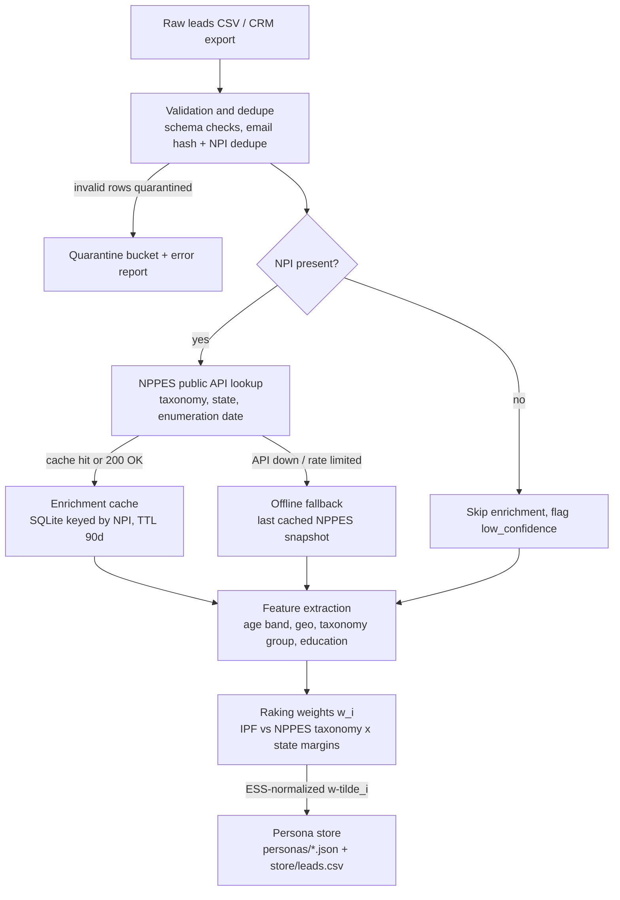
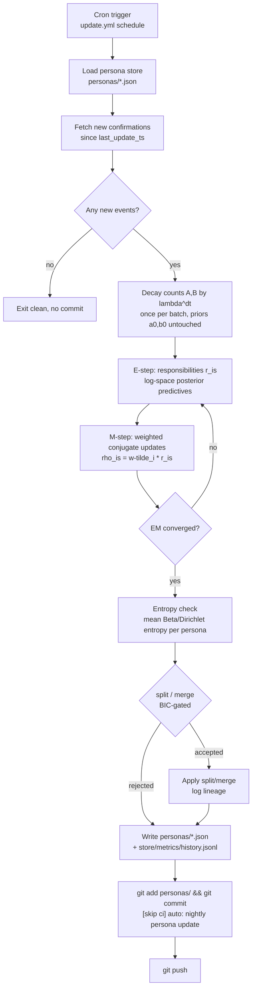
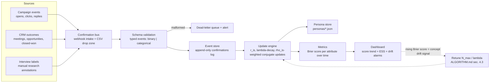
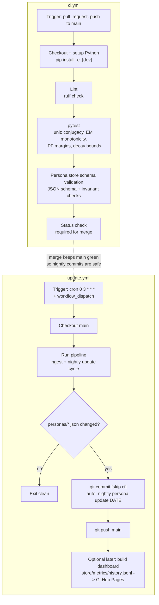

# psyche-engine

[](https://github.com/OWNER/psyche-engine/actions/workflows/ci.yml)
[](https://github.com/OWNER/psyche-engine/actions/workflows/update.yml)
[](LICENSE)
[](pyproject.toml)

**psyche-engine** is a Bayesian persona engine for lead/panel segmentation.
It maintains a mixture of *personas* whose attributes (binary propensities,
categorical preferences) are tracked with exact conjugate updates — Beta–Bernoulli
and Dirichlet–Categorical — corrected for sample-selection bias by raking
against population margins, and kept adaptive under concept drift by bounded
geometric forgetting with a provable stationary bias bound
`bias ≤ δλ/(1−λ)`.

Every claim above is pinned to a theorem in
[docs/ALGORITHM.md](docs/ALGORITHM.md) — conjugacy (§1), EM coordinate ascent
(§2.3), IPF convergence (§3.2), Kish ESS (§3.3), the N_max = (1−λ)⁻¹
equivalence (§4.1), and the drift bias/variance bounds (§4.3).

## Highlights

- **Exact conjugate posteriors** — the store keeps only sufficient statistics
  `(A, B)` plus immutable priors; posteriors are derived, never stored.
- **Soft assignment** — leads carry log-space responsibilities `r_is`; every
  count increment is weighted by `ρ_is = w̃_i · r_is` where `w̃` is
  ESS-normalized so each batch adds exactly `ESS ≤ n` pseudo-counts.
- **Raking** — iterative proportional fitting toward population margins
  (e.g. NPPES provider taxonomy × state) with Kish ESS and leverage trimming.
- **Bounded memory** — recency decay on counts only, applied once per batch
  pre-E-step; `λ = 1 − 1/N_max` gives an exact sliding geometric window.
- **Self-evaluating** — every confirmation is scored out-of-sample (Brier)
  *before* it is consumed; a rising Brier trend is the drift alarm.
- **Structural adaptation** — personas split/merge on posterior entropy and
  symmetrized KL, only when BIC decreases, all logged in `lineage`.
- **Auditable** — personas live as canonical-ordered JSON in git; the nightly
  GitHub Action commits them with `[skip ci]`.

## Install

```bash
pip install -e .          # runtime: numpy, scipy, pandas, requests
pip install -e .[dev]     # + pytest, ruff
```

## Quickstart

```bash
# ingest a leads CSV (validation, dedupe, NPPES enrichment, raking)
psyche ingest data/leads.csv --store store --margins data/population_margins.csv --offline

# run one update cycle over a confirmations CSV
psyche update data/confirmations.csv --store store

# inspect personas and metrics
psyche show --store store
```

Or fully programmatically / offline (no network):

```bash
python examples/simulate_demo.py   # synthetic two-segment drift demo
```

## Workflows

### 1. Ingestion & enrichment



### 2. Nightly update loop



### 3. Confirmation feedback loop



### 4. CI/CD



## Privacy

**No PII is ever persisted.** Persona JSONs and the lead store contain only
sha256-hashed lead IDs/NPIs, calibration-cell assignments (taxonomy, state)
and aggregate counts. Raw names, emails and NPIs are hashed in memory
immediately after use; NPIs leave the machine only as lookups to the public
NPPES registry they came from. Personas below the minimum responsibility mass
`n_min` are folded back into the global prior (k-anonymity guard,
ALGORITHM.md §7.5).

## Docs

- [docs/ALGORITHM.md](docs/ALGORITHM.md) — the math: conjugacy, EM proof,
  raking, drift bounds, split/merge, worked micro-example.
- [docs/WORKFLOWS.md](docs/WORKFLOWS.md) — pipeline and CI/CD design.
- [SPEC.md](SPEC.md) — exact module interfaces.

## License

MIT — see [LICENSE](LICENSE).
