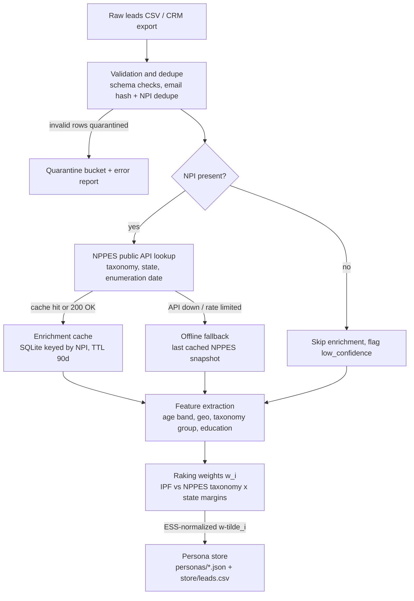
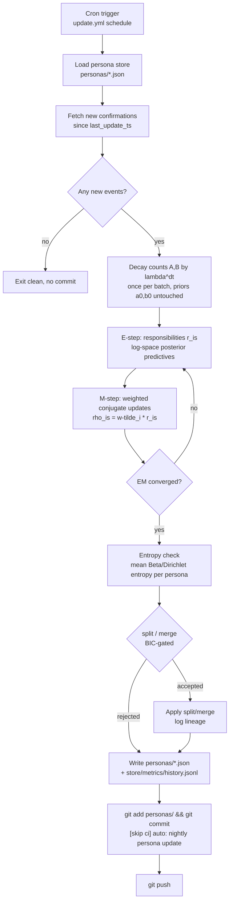
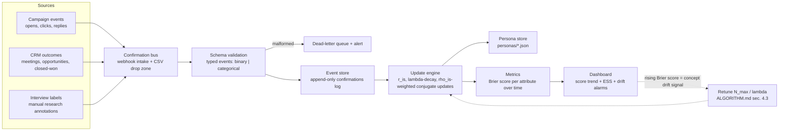
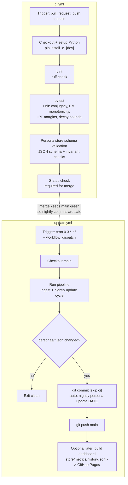

# psyche-engine — Workflow Design

Version 0.1 — Companion to `ALGORITHM.md`; notation is shared ($r_{is}$ = responsibility, $w_i$/$\tilde w_i$ = raking weights, $\lambda$ = decay, $(\alpha_{js},\beta_{js})$ / $\boldsymbol\alpha_{js}$ = persona hyperparameters, counts $A,B$).

---

## 1. Ingestion & enrichment pipeline

**Explanation.** Leads arrive as CSV or a CRM export and first pass schema validation and deduplication (email hash, then NPI as the stronger key); bad rows are quarantined, never silently dropped. Leads with an NPI are enriched from the NPPES public API, with every response cached in SQLite for 90 days so re-runs are cheap and deterministic. If the API is unavailable or rate-limited, the pipeline falls back to the most recent cached NPPES snapshot and marks the enrichment as stale rather than failing. Feature extraction then derives the calibration variables (taxonomy group, state) used by the raking step, which computes design weights $w_i$ against NPPES margins and normalizes them to $\tilde w_i$ with $\sum_i \tilde w_i = \mathrm{ESS}$ (see ALGORITHM.md §3). Everything lands in the persona store: per-lead features in `store/leads.csv`, per-persona hyperparameters and counts in `personas/*.json`.

---

## 2. Nightly update loop

**Explanation.** The nightly job loads the persona store and pulls only confirmations newer than the stored `last_update_ts`, exiting without a commit when there is nothing to do so history stays clean. Each batch runs the EM cycle of ALGORITHM.md §2: the stored counts $A,B$ are first decayed once by $\lambda^{\Delta t}$ (priors are immutable), responsibilities $r_{is}$ are then computed in log-space from the post-decay posterior predictives, and the M-step applies increments weighted by $\rho_{is}=\tilde w_i r_{is}$. The order matters: decay is applied exactly once per batch to pre-batch counts, before the E-step, so responsibilities always use post-decay, pre-M-step counts. After convergence, per-persona mean posterior entropy is compared against $\tau_{\text{split}}$ and candidate merges against $\tau_{\text{merge}}$; structural changes are only kept if BIC decreases, and every accepted change writes a `lineage` entry. Finally the updated `personas/*.json` and `store/metrics/history.jsonl` are committed with `[skip ci]` (so the auto-commit does not retrigger CI) and pushed, giving a fully auditable, git-versioned history of every persona.

---

## 3. Confirmation feedback loop

**Explanation.** Confirmations arrive from three source families — campaign events, CRM outcomes, and manual interview labels — and converge on a single confirmation bus that accepts webhooks for real-time sources and CSV drops for batch exports. Every event is validated into one of two typed forms (binary confirm/refute or categorical observation), matching the two conjugate families of ALGORITHM.md §1; malformed events go to a dead-letter queue rather than corrupting posteriors. Valid events land in an append-only log, which makes the nightly update idempotent and replayable: the store can always be rebuilt from the log plus priors. The update engine consumes events as in §2–4 of ALGORITHM.md, and — critically — each event is scored with the persona posterior *predictive before* the event is folded in, so the per-attribute Brier score $BS_j = \tfrac{1}{n}\sum_i (q_{js}(x_{ij}) - x_{ij})^2$ measures genuine out-of-sample skill. A sustained rise in Brier score indicates concept drift faster than the current $\lambda$ can track, feeding back into retuning $N_{\max}$ per the bound $\mathrm{bias}\le\delta\lambda/(1-\lambda)$.

---

## 4. CI/CD

**Explanation.** Two workflows separate code quality from data motion. `ci.yml` runs on every PR and push to `main`: lint, then pytest with property-style tests pinned to the math in ALGORITHM.md — Beta/Dirichlet update correctness, monotonicity of the EM lower bound, exact margin match after IPF, and the §4.3 bias bound checked by simulation — plus JSON-schema and invariant validation of the persona store (priors immutable, counts non-negative, $\sum_k\alpha_{jsk}$ consistent). `update.yml` runs on a nightly cron (with `workflow_dispatch` for manual runs), executes the ingestion and nightly-update cycle, and commits changed persona JSONs with `[skip ci]` and a timestamped message so the auto-commit never triggers CI and history stays readable. The `[skip ci]` tag plus the required status check on PRs together guarantee that `main` is always green when the nightly job commits on top of it. A GitHub Pages dashboard rendering `store/metrics/history.jsonl` (Brier trends, ESS, persona entropy) is a deliberate later addition — the data contract (`store/metrics/history.jsonl` schema) is established now so the dashboard is pure presentation work.

---

## Cross-document consistency notes

* $\tilde w_i$ (ESS-normalized raking weights) are computed once per ingestion run and frozen until leads change; the nightly loop reuses them.
* The decay factor $\lambda$ and $N_{\max}=1/(1-\lambda)$ live in each persona's JSON (`decay` block), not in workflow config, so drift tuning is per-persona and versioned.
* Every persona mutation path (nightly update, split/merge, manual seed) must pass the same schema + invariant validation used in `ci.yml`.
* The confirmation log is the single source of truth; persona JSONs are a derived, rebuildable artifact.
